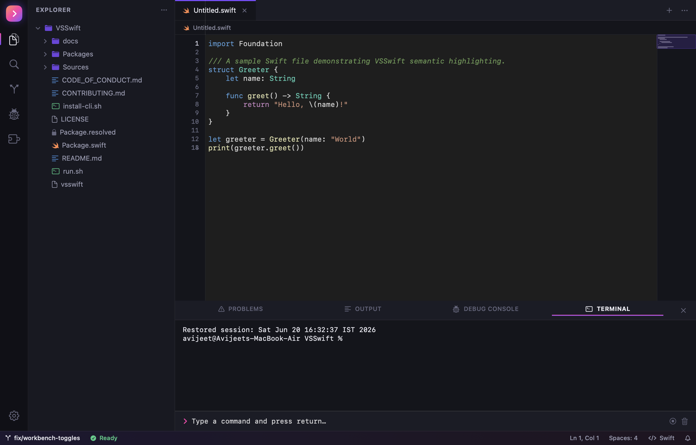
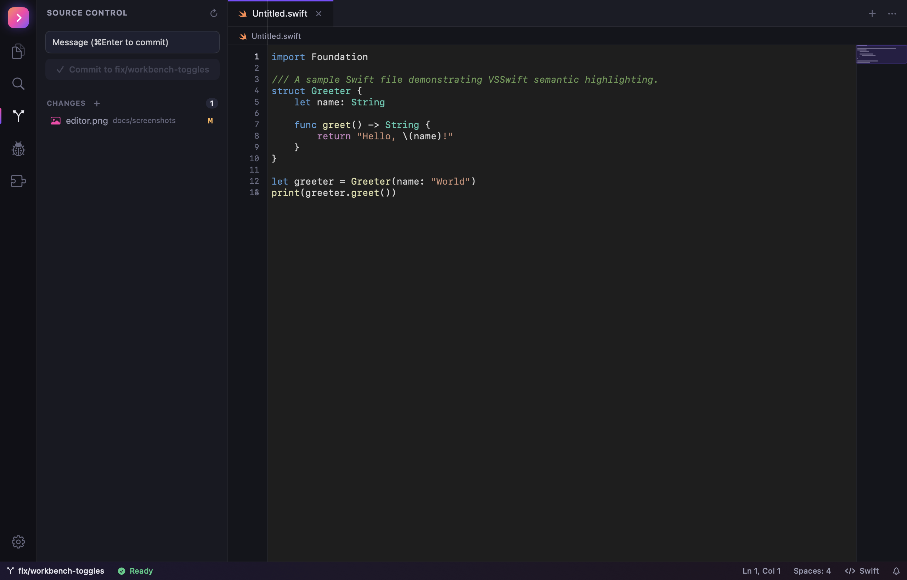
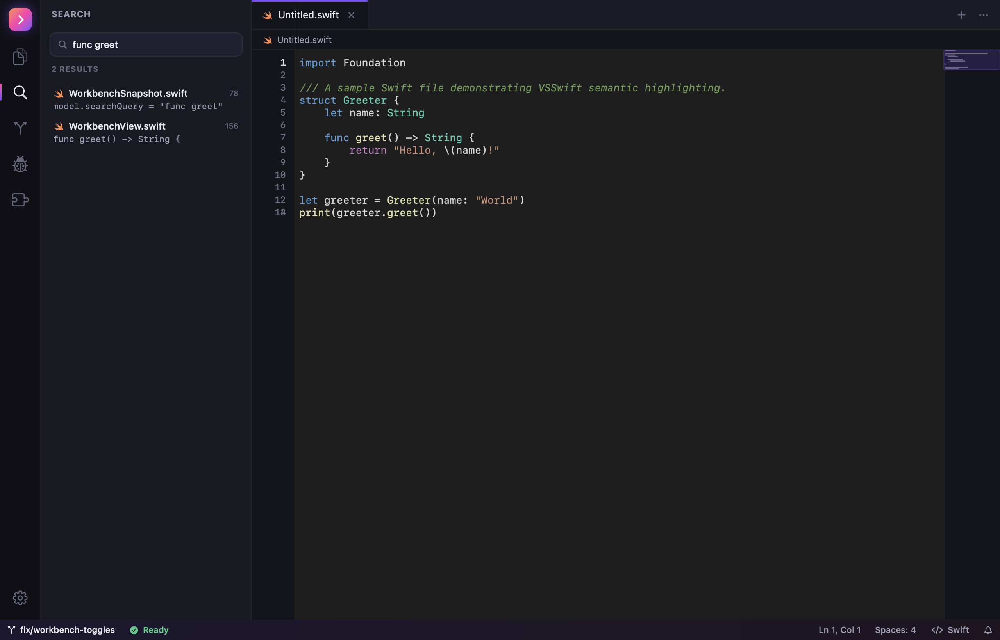

# VSSwift

[](https://github.com/avijeetpandey/VSSwift/actions/workflows/ci.yml)
[](https://swift.org)
[](https://www.apple.com/macos)
[](./LICENSE)

> ⚠️ **This is a fun, vibe-coded project — not for production use.** It's an experiment
> in building a VSCode-style editor in pure Swift/SwiftUI for the joy of it. Expect rough
> edges, missing features, and code written for delight rather than battle-hardening. 🙂

An enterprise-grade, modular **macOS native code editor** built with Swift & SwiftUI that
mirrors the Visual Studio Code UI/UX while keeping a strict, decoupled, actor-based
architecture. The text canvas is engineered to handle **100,000+ line files** with a
**0 ms main-thread budget** by isolating every expensive subsystem (LSP, syntax parsing,
file watching, search) behind Swift Concurrency actors.

## Features

- 📁 **Open Folder** — native folder picker (⌘O) to open any project.
- 💻 **`vsswift` CLI** — `vsswift .` opens the current folder, just like `code .`.
- 🌳 **Source Control** — VSCode-style Git panel: stage/unstage, discard, commit, diffs,
  live branch in the status bar.
- 🔎 **Workspace search** — parallel, ripgrep-style regex search across the tree.
- ⌨️ **Keyboard shortcuts** — ⌘B/⌘J/⌘\`, ⌘⇧E/⌘⇧F/⌃⇧G and more.
- 🖥️ **Integrated terminal** — a real PTY-backed shell.
- 🎨 **Semantic highlighting** — swift-syntax tokens + `sourcekit-lsp` completion.

---

## Screenshots

> Rendered straight from the app via its built-in headless snapshot tool
> (`VSSWIFT_RENDER`), so these are the real SwiftUI/AppKit workbench — not mockups.

### Editor + integrated terminal
The full workbench: the activity bar, a file explorer with type-aware icons, a TextKit 2
editor with live swift-syntax highlighting, the minimap, and the revamped bottom panel.
The integrated terminal is backed by a real PTY and rendered through a custom ANSI/OSC
emulator, so prompts, colors and command output are cleanly formatted and word-wrapped —
no leaked escape sequences. The panel tabs (Problems, Output, Debug Console, Terminal)
carry icons, and the terminal input row has prompt, interrupt and clear affordances.



### Source Control
A VSCode-style Git panel — staged/unstaged changes with status badges, a commit message
box that commits to the active branch, and the current branch mirrored into the status
bar. Refresh, stage, unstage and discard are wired to a real `git` backend.



### Workspace search
Parallel, ripgrep-style regex search across the workspace, with per-file results showing
the matching line and line number. Selecting a result opens the file in the editor.



---

## Table of Contents
1. [Architecture & Layer Constraints](#architecture--layer-constraints)
2. [SPM Module Map](#spm-module-map)
3. [Requirements](#requirements)
4. [Building & Running](#building--running)
5. [Running the Tests](#running-the-tests)
6. [Language Server (sourcekit-lsp) Setup](#language-server-sourcekit-lsp-setup)
7. [Troubleshooting](#troubleshooting)
8. [Phase Deliverables](#phase-deliverables)

---

## Architecture & Layer Constraints

VSSwift is an **SPM workspace** of isolated local packages. Dependencies flow in **one
direction only** (downward); a lower layer must never import a higher one:

```
            ┌───────────────────────────┐
            │        VSSwiftApp          │  @main App entry point (WindowGroup)
            └─────────────┬─────────────┘
                          │
            ┌─────────────▼─────────────┐
            │         VSSwiftUI          │  SwiftUI workbench shell + AppKit canvas
            └──┬─────────┬────────┬──────┘
               │         │        │
   ┌───────────▼──┐ ┌────▼─────┐ ┌▼──────────────┐
   │ VSSwiftEngine│ │VSSwiftLSP│ │VSSwiftWorkspace│   ┌──────────────┐
   └───────┬──────┘ └────┬─────┘ └───────┬───────┘   │VSSwiftSyntax │
           │             │               │           └──────┬───────┘
           └─────────────┴───────┬───────┴──────────────────┘
                                 │
                       ┌─────────▼─────────┐
                       │    VSSwiftCore    │  Models, themes, config, event bus
                       └───────────────────┘
```

**Hard rules enforced by the package graph:**
- `VSSwiftCore` has **no internal dependencies** — pure value types, themes, config, state.
- Engine / LSP / Workspace / Syntax depend **only on Core** and never on each other.
- `VSSwiftUI` is the only layer allowed to bridge **SwiftUI ↔ AppKit**.
- All targets compile under **Swift 6 strict concurrency** (`.swiftLanguageMode(.v6)`).
- Expensive work runs on **actors** (`TextDocument`, `LSPClient`, `WorkspaceManager`,
  `FileSystemWatcher`); results are hopped to `@MainActor` for UI application.

The full engineering rationale (rendering math, concurrency model, UI bridging) is
captured throughout the source comments and this README.

---

## SPM Module Map

| Package | Platform | Depends on | Responsibility |
|---|---|---|---|
| **VSSwiftCore** | macOS 13 | — | `TextPosition`/`VSSwiftRange`, `VSSwiftColor` (hex parsing), `Theme`/`TokenStyle`, VSCode JSON theme parser, builtin Dark+/Light+ themes, `ThemeEngine`, actor `EventBus`, `Configuration`, `AppState`, `VSSwiftToken`/`TokenBatch`. |
| **VSSwiftEngine** | macOS 13 | Core | `TextBuffer`, actor `TextDocument` + `DocumentSnapshot`, `FenwickTree`/`LineHeightIndex` (variable line heights), `FoldingProvider`, `SelectionManager` + `MultiCursorEditor`, `MinimapMetrics`. |
| **VSSwiftLSP** | macOS 13 | Core | `JSONValue`, `Content-Length` message framing + parser, LSP lifecycle Codables, actor `LSPClient` wrapping `Process`. |
| **VSSwiftSyntax** | macOS 13 | Core, [swift-syntax 600.0.1](https://github.com/apple/swift-syntax) | `UTF8PositionConverter`, `SwiftTokenParser` (`SyntaxVisitor` → `VSSwiftToken`). |
| **VSSwiftWorkspace** | macOS 13 | Core | `FileNode`/`FileTreeLoader`, actor `WorkspaceManager`, parallel `TaskGroup` regex `SearchEngine`, FSEvents `FileSystemWatcher`. |
| **VSSwiftGit** | macOS 13 | Core | `GitRunner` (non-interactive git subprocess), `GitStatusParser`, actor `GitService` (status, branch, stage/unstage, discard, commit, diff). |
| **VSSwiftUI** | macOS 14 | Core, Engine, LSP, Workspace, Syntax | SwiftUI workbench shell, `EditorCanvasView` (TextKit 2 `NSTextView` via `NSViewRepresentable`), `CompletionWidget`, activity/status bars, sidebar/explorer, PTY `PseudoTerminal` + terminal view, minimap, `WorkbenchModel`/`WorkbenchView`. |
| **VSTestKit** | macOS 13 | — | Custom XCTest-free test harness (see below). |
| **VSSwiftApp** (root) | macOS 14 | VSSwiftUI | `@main` executable; hosts `WorkbenchView` in a `WindowGroup` with ⌘B / ⌘J shortcuts. |

---

## Requirements

- **macOS 14+** (Sonoma) on **Apple Silicon** recommended for the 120 FPS canvas targets.
- **Swift 6.3+** toolchain. Xcode is *not* required — Command Line Tools are sufficient.
- `sourcekit-lsp` (ships with the toolchain / Command Line Tools).

Verified configuration: macOS 26.5.1, Apple Silicon, Swift 6.3.2.

---

## Building & Running

The simplest way — one command builds and launches the editor:

```bash
./run.sh                # build (release) + launch
./run.sh --debug        # debug build + launch
./run.sh --build-only   # build without launching
./run.sh --test         # build + run all test suites
./run.sh --clean        # wipe .build, then build + launch
./run.sh --help         # usage
```

Or invoke SwiftPM directly:

```bash
cd /path/to/VSSwift

# Build everything (app + all packages). First run fetches swift-syntax (~3 min).
GIT_CONFIG_COUNT=0 swift build

# Launch the editor
GIT_CONFIG_COUNT=0 swift run VSSwift

# Faster, optimized binary
GIT_CONFIG_COUNT=0 swift build -c release
```

> **Why `GIT_CONFIG_COUNT=0`?** See [Troubleshooting](#troubleshooting). It is required for
> any command that resolves remote SPM dependencies in this environment.

### Keyboard shortcuts
| Shortcut | Action |
|---|---|
| ⌘B | Toggle sidebar |
| ⌘J | Toggle bottom panel |
| ⌘` | Toggle integrated terminal |
| ⌘O | Open folder… |
| ⌘⇧E | Show Explorer |
| ⌘⇧F | Show Search |
| ⌃⇧G | Show Source Control |
| ⌘⇧D | Show Run and Debug |
| ⌘⇧X | Show Extensions |

### `vsswift` command-line launcher

Open any folder in the editor straight from the terminal, just like VSCode's `code .`:

```bash
# One-time install (symlinks `vsswift` onto your PATH)
./install-cli.sh                 # installs into /usr/local/bin
./install-cli.sh "$HOME/.local/bin"   # or a custom, writable dir

# Then, from any project folder:
vsswift .                        # open the current directory
vsswift ~/dev/some-project       # open a specific folder
vsswift --help                   # usage
```

On first use the launcher builds the release binary, then launches the editor in
the background (your shell returns immediately). The target folder is passed to the
app via the `VSSWIFT_OPEN` environment variable.

---

## Running the Tests

This project was built with **Command Line Tools only (no Xcode)**, so **XCTest and
swift-testing are unavailable**. Instead, each package ships an executable test target
backed by the custom **VSTestKit** harness. Run a suite with `swift run`:

```bash
# Run an individual package's suite
(cd Packages/VSSwiftCore      && GIT_CONFIG_COUNT=0 swift run VSSwiftCoreTests)
(cd Packages/VSSwiftEngine    && GIT_CONFIG_COUNT=0 swift run VSSwiftEngineTests)
(cd Packages/VSSwiftLSP       && GIT_CONFIG_COUNT=0 swift run VSSwiftLSPTests)
(cd Packages/VSSwiftSyntax    && GIT_CONFIG_COUNT=0 swift run VSSwiftSyntaxTests)
(cd Packages/VSSwiftWorkspace && GIT_CONFIG_COUNT=0 swift run VSSwiftWorkspaceTests)
(cd Packages/VSSwiftGit       && GIT_CONFIG_COUNT=0 swift run VSSwiftGitTests)

# Or run them all
for p in Core Engine LSP Syntax Workspace Git; do
  (cd Packages/VSSwift$p && GIT_CONFIG_COUNT=0 swift run VSSwift${p}Tests)
done
```

**Coverage highlights**
- **Core**: theme color/hex parsing, longest-prefix scope resolution, config, event bus.
- **Engine**: text-buffer thread-safety, Fenwick line-height index (incl. a **100k-line
  build + 10k-query** performance benchmark), folding, multi-cursor merge semantics.
- **LSP**: `Content-Length` header framing, JSON-RPC Codable round-trips, and a **live
  `sourcekit-lsp` `initialize` handshake**.
- **Syntax**: `SwiftTokenParser` entity→scope mapping, UTF-8 column accuracy with unicode,
  throughput (22k tokens in ~56 ms).
- **Workspace**: file-tree loading, parallel regex search, **live FSEvents** detection.
- **Git**: porcelain status parsing (branch/ahead-behind/rename/conflict) and a **live
  repository** stage/unstage/commit/discard/diff lifecycle.

---

## Language Server (sourcekit-lsp) Setup

`VSSwiftLSP` launches the language server as an isolated subprocess and talks JSON-RPC 2.0
over its stdio pipes. The binary is located via:

```bash
xcrun --find sourcekit-lsp
# e.g. /Library/Developer/CommandLineTools/usr/bin/sourcekit-lsp
```

If `xcrun` cannot find it, install the Command Line Tools:

```bash
xcode-select --install
```

For best results open a folder that is a valid Swift package (contains `Package.swift`) so
`sourcekit-lsp` can resolve the build settings for completion and diagnostics.

---

## Regenerating the screenshots

The README screenshots are produced by the app's headless snapshot tool, which renders the
real workbench (including the AppKit text canvas) to a PNG. Set `VSSWIFT_RENDER` to the
output path and `VSSWIFT_RENDER_SCENE` to one of `editor`, `sourceControl`, or `search`:

```bash
swift build -c release
BIN=.build/release/VSSwift
VSSWIFT_RENDER=docs/screenshots/editor.png         VSSWIFT_RENDER_SCENE=editor        "$BIN"
VSSWIFT_RENDER=docs/screenshots/source-control.png VSSWIFT_RENDER_SCENE=sourceControl "$BIN"
VSSWIFT_RENDER=docs/screenshots/search.png         VSSWIFT_RENDER_SCENE=search        "$BIN"
```

---

## Troubleshooting

**`swift build` fails resolving `swift-syntax` / bare-repository errors.**
This environment injects `safe.bareRepository=explicit` via `GIT_CONFIG_KEY_0` /
`GIT_CONFIG_VALUE_0` / `GIT_CONFIG_COUNT` environment variables, which breaks SwiftPM's git
dependency fetching. **Always prefix dependency-resolving commands with
`GIT_CONFIG_COUNT=0`**, e.g. `GIT_CONFIG_COUNT=0 swift build`.

**"No such module XCTest" / cannot run tests the usual way.**
Expected — only Command Line Tools are installed, so XCTest is absent. Use the VSTestKit
executable suites described in [Running the Tests](#running-the-tests).

**First build is very slow (~3 minutes).**
`swift-syntax` (600.0.1) is a large source dependency compiled from scratch on first build.
Subsequent builds are incremental; use `-c release` for a cached optimized binary.

**`@main` errors / "main attribute cannot be used in a module that contains top-level code".**
The entry file must be `Sources/VSSwiftApp/VSSwiftApp.swift` (not `main.swift`).

**FSEvents watcher tests fail intermittently.**
FSEvents has a coalescing latency; the tests allow a small delay. Re-run if the machine is
under heavy I/O load.

---

## Phase Deliverables

| Phase | Scope | Status |
|---|---|---|
| 0 | Engineering analysis (concurrency & rendering model) | ✅ |
| 1 | Core models + theme engine + SwiftUI workbench shell | ✅ |
| 2 | High-performance engine: buffer, Fenwick index, folding, minimap | ✅ |
| 3 | Multi-cursor `SelectionManager` | ✅ |
| 4 | swift-syntax semantic tokens + `sourcekit-lsp` client + completion UI | ✅ |
| 5 | Multi-root workspace tree + FSEvents + parallel search + PTY terminal | ✅ |
| 6 | Open Folder + `vsswift` CLI + Source Control (`VSSwiftGit`) + shortcuts | ✅ |

All logic packages compile under Swift 6 strict concurrency with passing test suites; the
`VSSwiftApp` executable builds and links.

---

## Contributing

Contributions are welcome in the same playful spirit the project was built in! See
[CONTRIBUTING.md](./CONTRIBUTING.md) and the [Code of Conduct](./CODE_OF_CONDUCT.md).

```bash
./run.sh --build-only   # build
./run.sh --test         # run all suites
./run.sh --format       # apply swift-format
./run.sh --lint         # check formatting (advisory)
```

## License

Released under the [MIT License](./LICENSE). Again: this is a **fun, vibe-coded
experiment — not for production use**. Have fun with it! ✨

